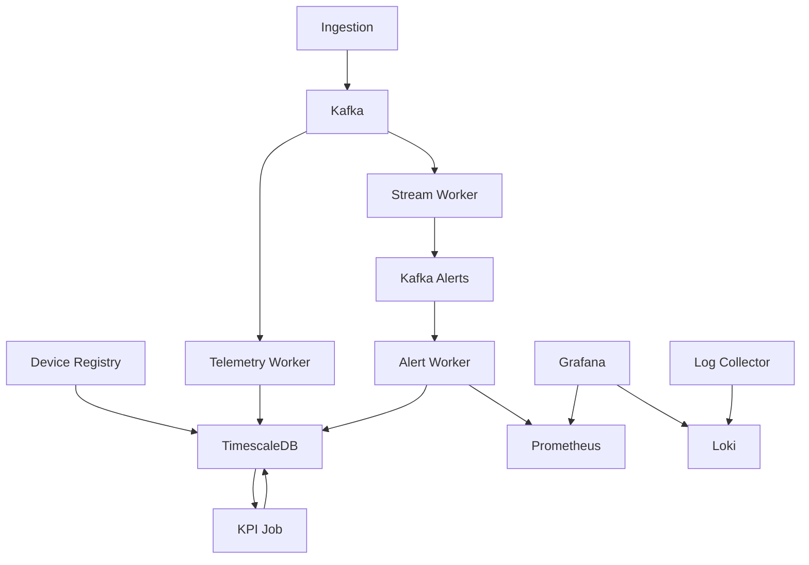

# IoT Analytics Platform

A microservices-based IoT analytics platform for device management, telemetry ingestion, and real-time analytics.

## Architecture



## Quick Start

### Local Development
```bash
cd services
docker-compose up --build
```

### Kubernetes Deployment
```bash
cd iot-analytics
helm install iot-analytics . -f values-dev.yaml
```

## Components

| Component | Type | Purpose |
|-----------|------|---------|
| Device Registry | Java/Spring | CRUD device management |
| Ingestion | Java/Spring | Telemetry → Kafka |
| Telemetry Worker | Python | Kafka → TimescaleDB |
| Stream Worker | Python | Real-time alerts |
| Alert Worker | Python | Alert processing & metrics |
| KPI Job | Python | Batch analytics |
| TimescaleDB | PostgreSQL | Time-series storage |
| Kafka | Message Broker | Event streaming |
| Prometheus | Monitoring | Metrics collection |
| Grafana | Visualization | Dashboards |
| Loki | Logging | Log aggregation |

## APIs

### Device Registry (8080)
- `GET/POST/PUT/DELETE /devices` - Device CRUD

### Ingestion (8081)
- `POST /telemetry` - Ingest data

## Monitoring

- Metrics: `/metrics` on workers (8100-8102)
- Dashboards: Grafana (3000)
- Logs: Loki via Grafana

## Development

### Build Services
```bash
cd services/device-registry && mvn package
cd ../ingestion && mvn package
```

### Run Workers
```bash
cd services/workers
docker-compose up telemetry-worker stream-worker alert-worker
```

### Test Data
```bash
# Create device
curl -X POST http://localhost:8080/devices \
  -d '{"name":"CNC-001","type":"cnc_machine"}'

# Send telemetry
curl -X POST http://localhost:8081/telemetry \
  -d '{"deviceId":"cnc-001","sensorType":"temperature","value":{"value":65.5}}'
```